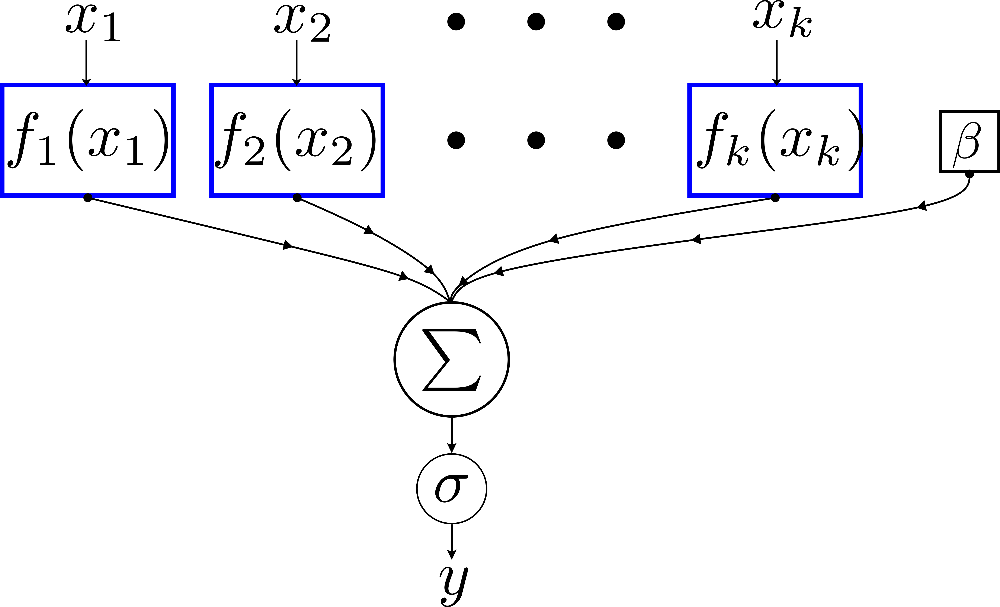

# Generalized Additive Model for traffic prediction


<center></center>

This repo contain 3 Jupyter Notebooks for trajectory prediction of pedestrains, based on velocity & direction. The results outperform many deep learning model, sometimes without any roadmap information.


# Setup

The datasets files should be downloaded and extracted in the same directory as the notebooks. Namely, they are:

- Stanford Drone Dataset : Just the text files are needed, each inside its folder in a parent `data` folder, [Download from here](https://cvgl.stanford.edu/projects/uav_data/)
- Intersection Drone Dataset: The csv files are needed inside `indds` parent folder. [Download from here](https://levelxdata.com/ind-dataset/)
- Argoverse 2 for Motion Forcasting: train and val files should be extracted directly next to the notebook [Download from here](https://www.argoverse.org/av2.html#forecasting-link)


After that required python packages should be installed by:

```
pip install -r requirements.txt
```

Lastly, the notebook can be run directly cell-by-cell to check the results.

## Cition info : 

If you used this work in your porject, consider citing the following paper:

*Coming soon*


Additionally, if you like this project, you can star it

